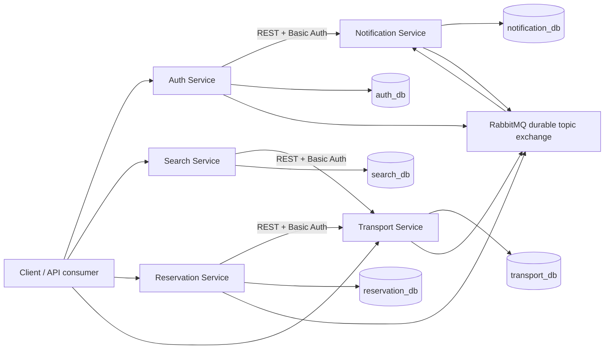
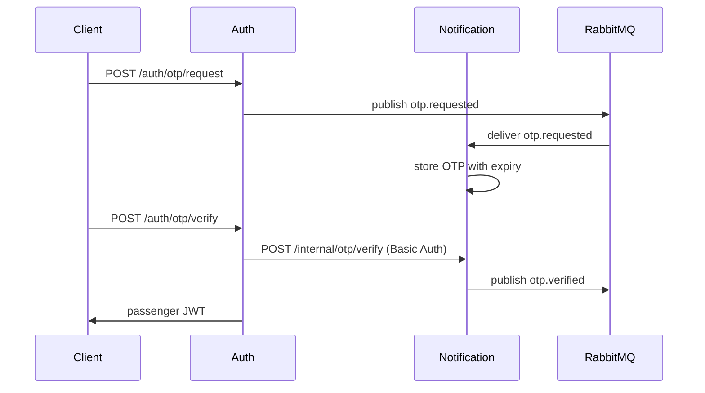
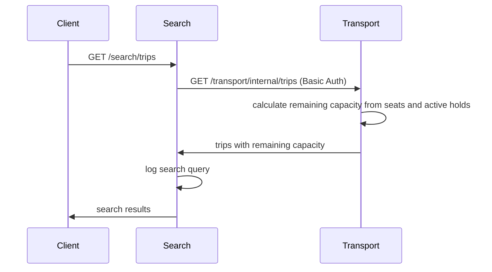
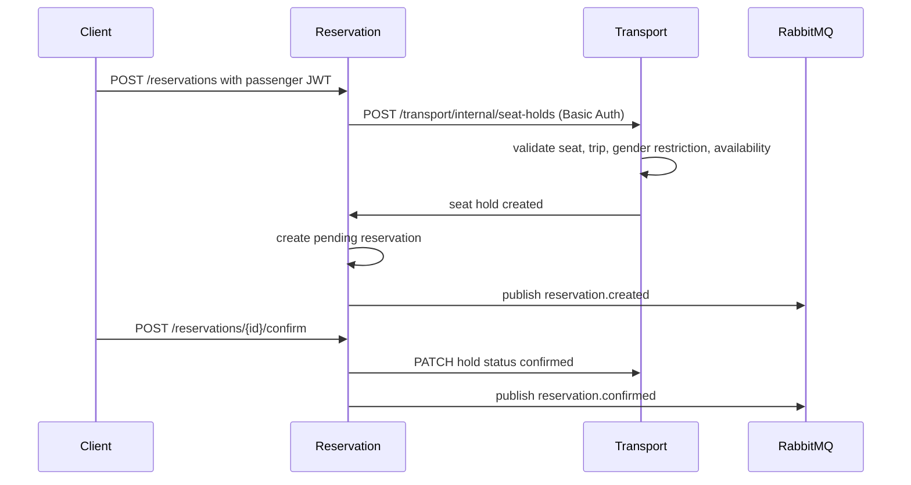

# Technical Design Document

## Architecture

## Service Responsibilities

Auth Service:
- Registers users with roles `admin`, `transport_owner`, and `passenger`.
- Authenticates admin and transport-owner users with password credentials.
- Issues JWTs containing `sub`, `role`, `gender`, and `phone_number`.
- Publishes `otp.requested` events for passenger authentication.
- Calls Notification over Basic Auth to verify OTP.

Transport Service:
- Owns transport companies, buses, seats, trips, and seat holds.
- Enforces transport-owner ownership for resource management.
- Supports reservable/non-reservable seats and gender restrictions: `none`, `male`, `female`.
- Exposes internal Basic-auth endpoints for Search and Reservation.

Search Service:
- Publicly exposes trip search by origin, destination, and departure date.
- Calls Transport over REST + Basic Auth.
- Logs search queries to its own PostgreSQL database.

Reservation Service:
- Owns reservation records and lifecycle status.
- Creates `pending` reservations after Transport successfully holds a seat.
- Confirms, cancels, and expires reservations.
- Publishes reservation lifecycle events to RabbitMQ.

Notification Service:
- Consumes durable `otp.requested` events.
- Generates OTP codes with expiry.
- Verifies OTP through an internal Basic-auth endpoint.
- Publishes `otp.verified` and `otp.rejected` events.

## Data Flow

## Event Flow

All services publish to a durable RabbitMQ topic exchange named `bus_reservation.events`.

Important events:
- `otp.requested`
- `otp.verified`
- `otp.rejected`
- `trip.created`
- `seat.updated`
- `seat.held`
- `reservation.created`
- `reservation.confirmed`
- `reservation.cancelled`
- `reservation.expired`

Notification consumes `otp.requested` from a durable queue. Failed handling is retried by republishing the same event with an `x-retry-count` header up to three attempts, then rejected without requeue.

## Security

User authentication:
- JWT bearer tokens are used for user-facing protected endpoints.
- JWTs include role and gender claims so Transport and Reservation can enforce RBAC and seat restrictions without sharing the Auth database.

Service-to-service authentication:
- Internal REST endpoints use HTTP Basic credentials.
- Credentials are passed through environment variables and are distinct per caller/target pair.
- Auth also exposes `/auth/internal/basic/validate` as a central validation endpoint.

## Databases and Migrations

Each service owns a separate PostgreSQL database:
- `auth_db`
- `transport_db`
- `search_db`
- `reservation_db`
- `notification_db`

Each service has its own Alembic migration directory and Docker startup runs `alembic upgrade head` before starting FastAPI.
